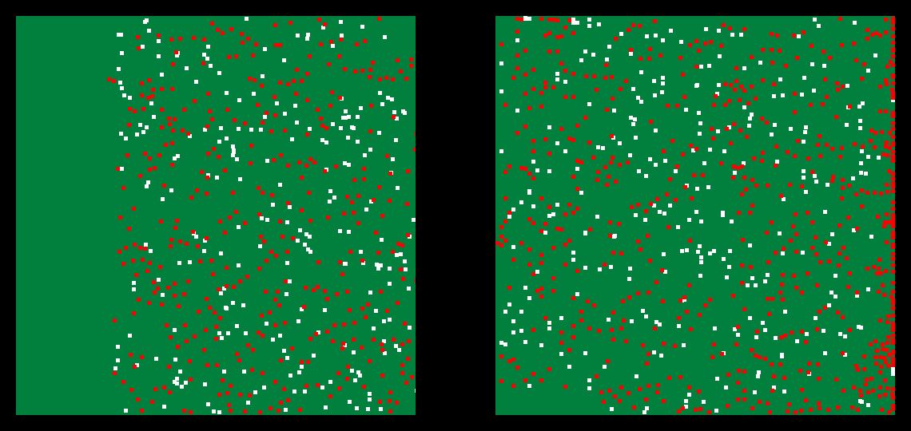
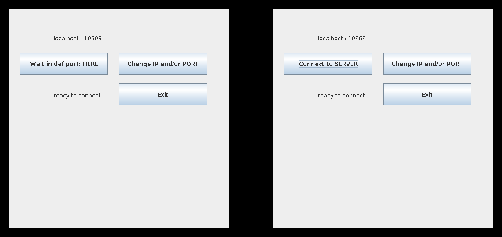
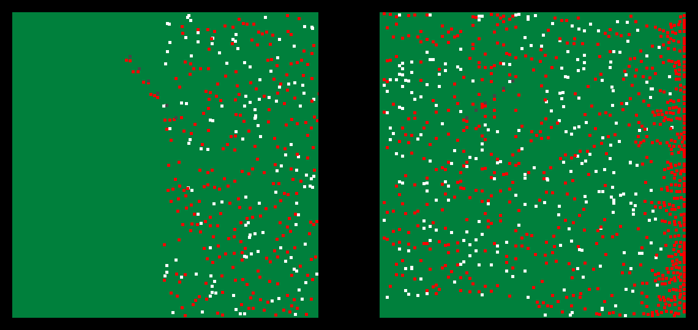
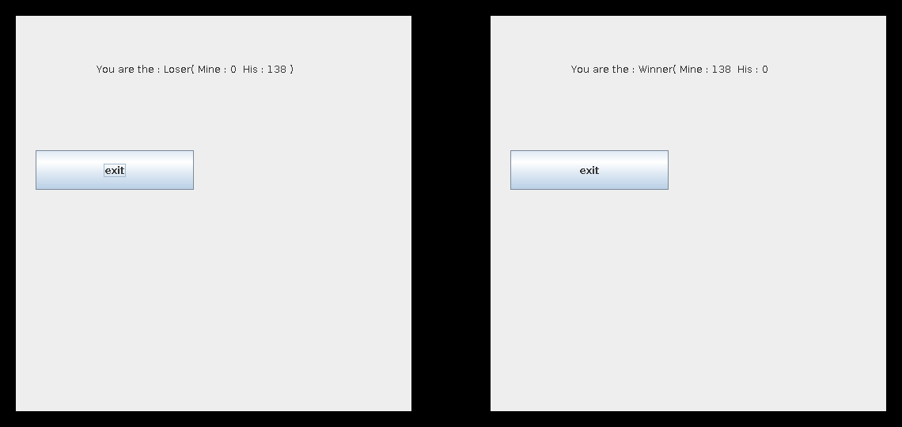

# Sheep & Wolves — two-player networked Java game

The main project for my Java course: a two-player game played over the network. The first player acts as the server, the second one connects to it as a client, so the two can play from anywhere.

It was a fun experience overall.



## The game

The two players share one field full of animals, but each of them only sees their own half of it.

- There are two kinds of animals: 🐑 **sheep** (white) and 🐺 **wolves** (red). They move around randomly.
- If a wolf and a sheep step on the same spot, the wolf eats the sheep.
- Animals that walk off the edge of your half cross over to the other player's screen.
- By **clicking**, you place a **wall** that animals can't pass through. Walls disappear after a while.
- The game is timed. When the time is up, whoever has more sheep on their side wins.

## Screens

**Main menu** – Player 1 waits for a connection on a port, Player 2 connects to the server. IP address and port can be changed.



**Walls** – the grey squares are walls placed by clicking; they block the animals for a few seconds.



**Result** – after the time runs out both players see who won and how many sheep each had.



## Under the hood

- **Client–server over sockets** – no separate server is needed, one player's game hosts the match
- **Thread per animal** – every animal runs on its own thread, with the concurrency handled so animals don't overlap or step into walls
- **Only crossing animals are sent** over the socket (plus the game-control messages), not the whole game state
- **Extendable entities** – sheep and wolves share a common `Animal` base class, so adding a new animal type is simple
- **Connection loss is handled** – the GUI shows a notice if the other player disconnects

```
org.example
├── Entities/          Animal, Sheep, Wolf, Wall
├── Field_components/  game logic, drawing, server and client side
├── Frames/            menu, IP/port settings, result screen
└── Main.java
```

## More screenshots


